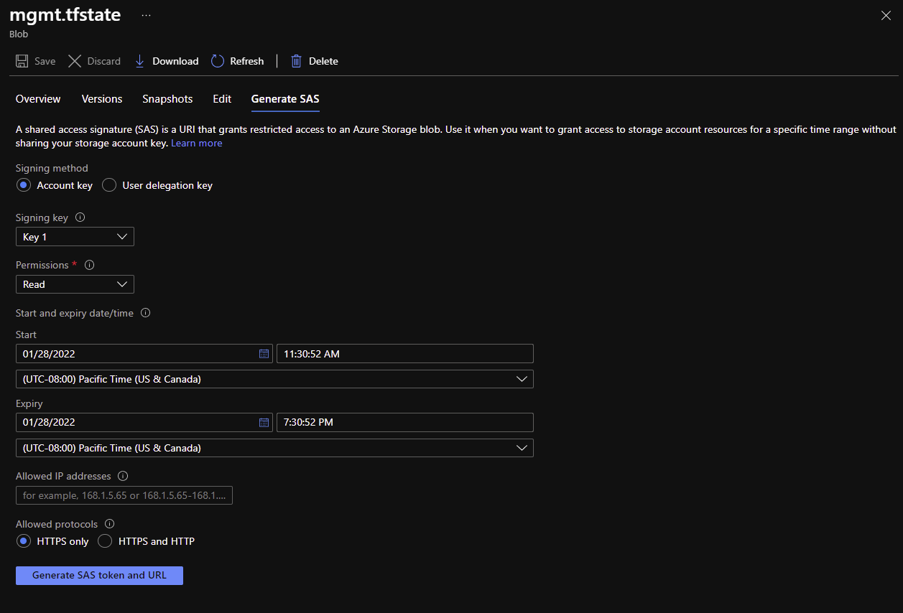
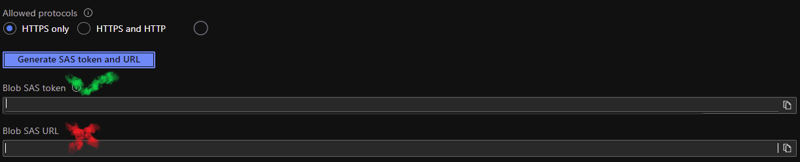

# ParaDocs 

## What the tool is for: 
* Generating documentation for cloud native tools
* Generating documentation for cloud resources deployed via Terraform, Pulumi, ARM, etc.
* Generating documentation for k8s(Helm etc.)
* Future use cases
  * Docs generated for modern programming languages
  * Docs generated for Projects via Azure DevOps, Jira, and GitHub 
  * Integration for agnostic pipeline support 
## How to install: 
  * Run ```make all``` in your shell 
    * This will compile the exe and add it to your $PATH 
    * If the ```make``` command fails, install Make by using Chocolatey and running ```choco make install```
  * Test with ```paradocs --help```
## How to use ParaDocs:
### Authentication for state providers: 
#### Google Cloud 
[Oauth2Token Creation](https://developers.google.com/identity/protocols/oauth2) (Needed for authentication to Cloud Storage API)<br>
[REST API Docs](https://cloud.google.com/storage/docs/downloading-objects) (You will need to authorize your token as seen below)<br>

#### AWS
[Access Developer Credentials](https://docs.aws.amazon.com/sdk-for-javascript/v2/developer-guide/getting-your-credentials.html)

* You will need the following 
  * Session Token 
  * Access Key
  * Secret Access Key
  * Region 
  * S3 Bucket Name 
  * Object Name/Path
#### Azure
[Create a SAS token for storage blob](https://docs.microsoft.com/en-us/azure/cognitive-services/translator/document-translation/create-sas-tokens?tabs=Containers) <br>
<br>
Only grab the actual token field for cli use<br>


#### Terraform Cloud (TFC ONLY NO ENTERPRISE CURRENTLY!) 
[Create API Token](https://www.terraform.io/cloud-docs/users-teams-organizations/api-tokens)
* You will need the following:
  * API token 
  * Workspace ID
### Terraform documentation:
### Sample commands:
* ```paradocs code terraform --working-dir <insert target path here>```
  * All docs that are generated will be stored in current working directory
  * Future support being added to specificy what directory to ouput too as well as running against remote code stored in GitHub, Gitlab, etc
## How to contribute:
  * Request access 
  * Fork repo 
  * Add features 
  * Submit PR 
### Working with Cobra:
  [Cobra CLI Docs](https://github.com/spf13/cobra) <br>
  [Viper Docs](https://github.com/spf13/viper)
### Pull requests:
#### All PR's have the following policies for approval: 
1. Minimum required reviewers 
2. Code review by code owners 
3. All checks must pass(builds)
4. Code merged to main via PR only


