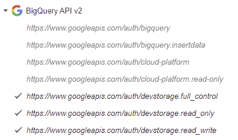
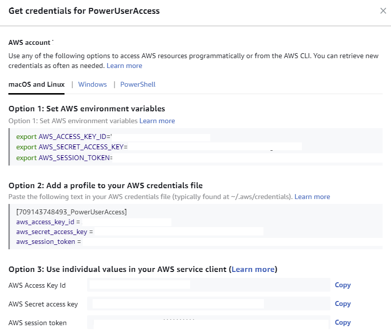

# ParaDocs 

## What the tool is for: 
* Generating documentation for cloud native tools
* Generating documentation for cloud resources deployed via Terraform, Pulumi, ARM, etc.
* Generating documentation for k8s(Helm etc.)
* Future use cases
  * Docs generated for modern programming languages
  * Docs generated for Projects via Azure DevOps, Jira, and GitHub 
  * Integration for agnostic pipeline support 
## How to install: 
  * Run ```make all``` in your shell 
    * This will compile the exe and add it to your $PATH 
  * Test with ```paradocs --help```
## How to use ParaDocs:
### Authentication for state providers: 
#### Google Cloud 
[Oauth2Token Creation](https://developers.google.com/identity/protocols/oauth2) (Needed for authentication to Cloud Storage API)<br>
[REST API Docs](https://cloud.google.com/storage/docs/downloading-objects) (You will need to authorize your token as seen below)<br>

#### AWS
[Access Developer Credentials](https://docs.aws.amazon.com/sdk-for-javascript/v2/developer-guide/getting-your-credentials.html)

* You will need the following 
  * Session Token 
  * Access Key
  * Secret Access Key
  * Region 
  * S3 Bucket Name 
  * Object Name/Path
#### Azure 

#### Terraform Cloud (TFC ONLY NO ENTERPRISE CURRENTLY!) 
### Terraform documentation:
### Sample commands:
## How to contribute:
### Working with Cobra:
### Pull requests:
## References: 
### API docs: 
### Cobra docs:
### Golang docs: 

